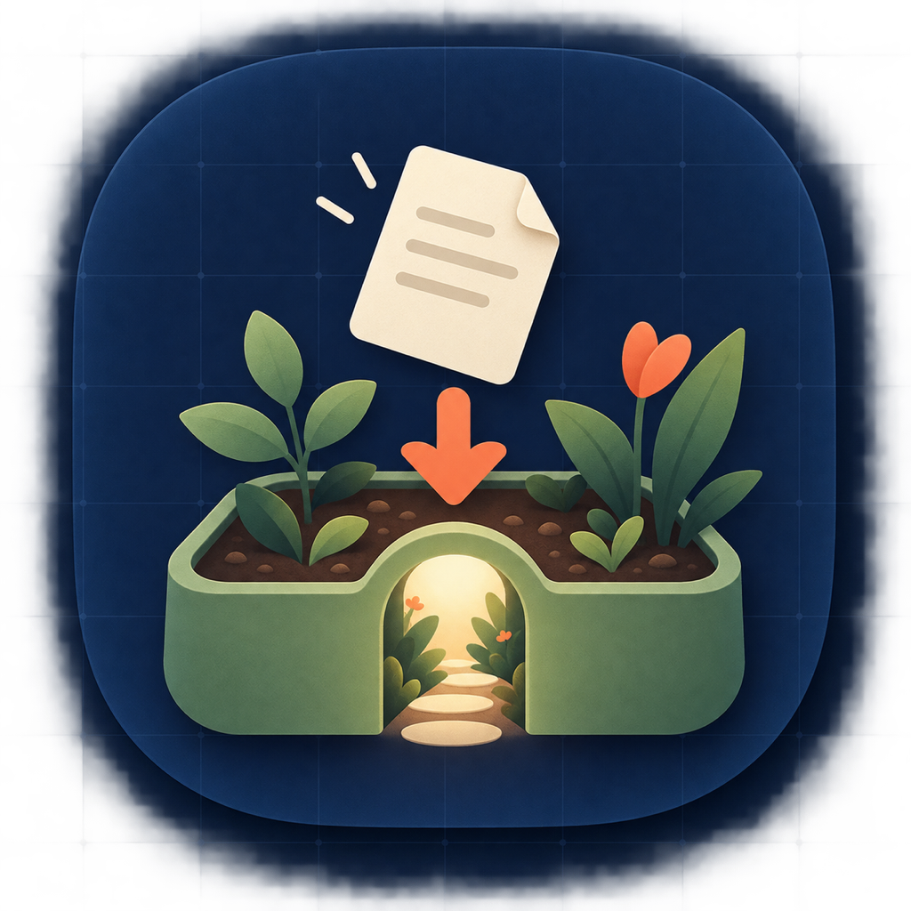

<p align="center">
  
</p>

# GardenDrop

Drop a link, note, or file into an Obsidian vault without leaving what you are doing. GardenDrop is a native, local-first macOS menu-bar utility with an optional notch surface.

## Requirements

- Apple-silicon Mac running macOS 14 or newer
- An existing Obsidian vault
- Swift 6 / Xcode 16+ for local builds

## Build and run

```sh
swift test
swift run GardenDrop
```

Build the installable version with:

```sh
./scripts/build-dmg.sh
open dist/GardenDrop-0.4.5.dmg
```

## First run

1. Open **Settings…** from the menu-bar icon and choose the folder containing your Obsidian vault.
2. Keep **Menu Bar Only**, or enable **Menu Bar + Notch** for the top-center hover surface.
3. Choose **New Capture…**, then drop or enter a link, file, or note.
4. Pick a quick folder, another vault folder, or an existing Markdown file.

GardenDrop remembers the last destination that successfully received a capture. Folder destinations create a new Markdown note; file destinations append without replacing existing text.

## Vault writes

```text
Areas/<Area>/Captures/<capture-id>.md
Attachments/Captures/<capture-id>/<filename>
```

You can replace the three quick folders in Settings. Paths are stored relative to the vault and treated as private unless their area map explicitly declares `visibility: garden`. Personal, Private, Karage Work, missing maps, and malformed maps always remain private.

The app stores only a security-scoped bookmark in preferences. Captures and attachments stay in the selected vault; there is no cloud capture service.

Local builds are ad-hoc signed, so macOS may require Control-click → Open the first time. Public distribution still requires Developer ID signing and Apple notarization.
